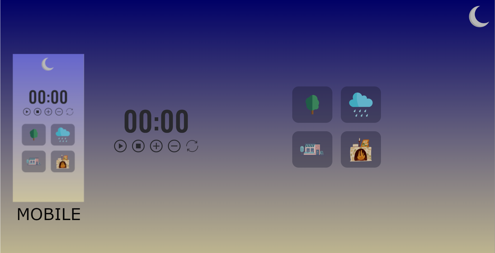

## Projeto FocusTimer / Rocketseat / Explorer

> O projeto se trata de criar cronómetro com funcionalidades.

[😊⭐⭐Clique aqui para acessar⭐⭐😊](https://romeusorionaet.github.io/FocusTimer/)

# Funcões do cronómetro

- Play -> aciona o timer.
- Stop -> para o timer.
- mais -> aumenta em mais 5 minutos o tempo do timer.
- menos -> diminui em 5 minutos o tempo do timer.
- reset -> reseta o cronómetro.

# Funções cards

> Cada card quando clicado, vai mudar de cor e emitir um som diferente. 

# Tecnologias utilizadas
- HTML
- CSS
- JavaScript

# Vamos nos conectar!
- [linkdin⭐](https://www.linkedin.com/in/romeu-soares-87749a231/)

- [Instagram⭐](http://instagram.com/romeusoaresdesouto)